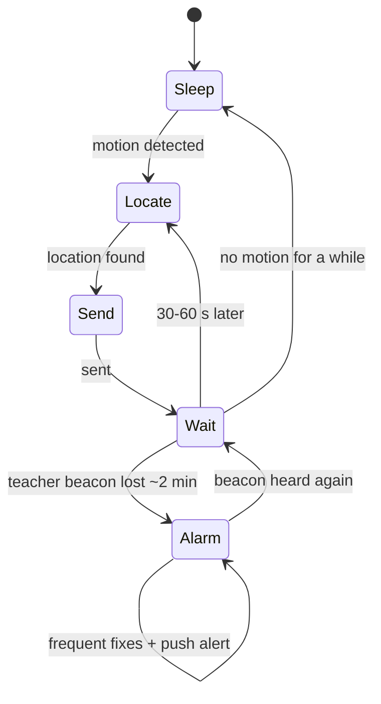

# Firmware

Firmware is the software that runs on the tracker itself, like the apps on a phone but for one small device.

## What it will do

1. Sleep to save battery until the motion sensor says "we're moving".
2. Find its location using the **location ladder**: WiFi first, then GPS, then cell towers.
3. Send the location over the cellular network.
4. Keep listening for the teacher's beacon. If it is gone for about 2 minutes, switch to alarm mode.

## Planned behaviour

## Architecture

Not chosen yet. It will follow from the dev kit choice (problem P06).

## Decisions

| Decision | Options considered | Why |
|---|---|---|
| Start from a ready-made demo, then change it | Demo first; write from scratch | Seeing a working chain first makes each later change easy to understand. |
