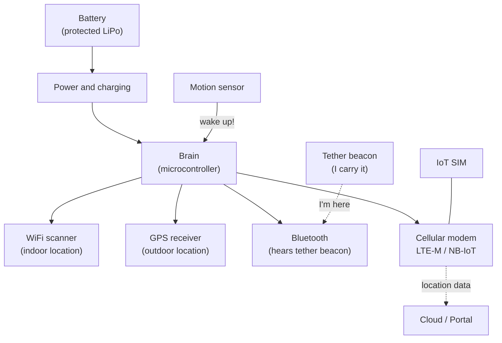

# Hardware

What the tracker is made of, and why.

## Block diagram

Each box is one job. The arrows show who talks to whom.

## Components considered

| Option | What it is | Status |
|---|---|---|
| Nordic Thingy:91 X | Ready-made dev kit with cellular, GPS, WiFi scanning, Bluetooth, motion sensor and battery in one box | Candidate, not bought |

A full comparison (max 3 options) comes with problem P06.

## Bill of materials (BOM)

A BOM is the shopping list of every part. Nothing has been bought yet; every purchase is proposed and justified first.

| Part | Purpose | Price | Link |
|---|---|---|---|
| *(empty until P06)* | | | |

## Decisions

| Decision | Options considered | Why |
|---|---|---|
| Start with a dev kit, not a custom board | Dev kit; custom board | A dev kit works out of the box, so I learn the ideas first and soldering later. |
