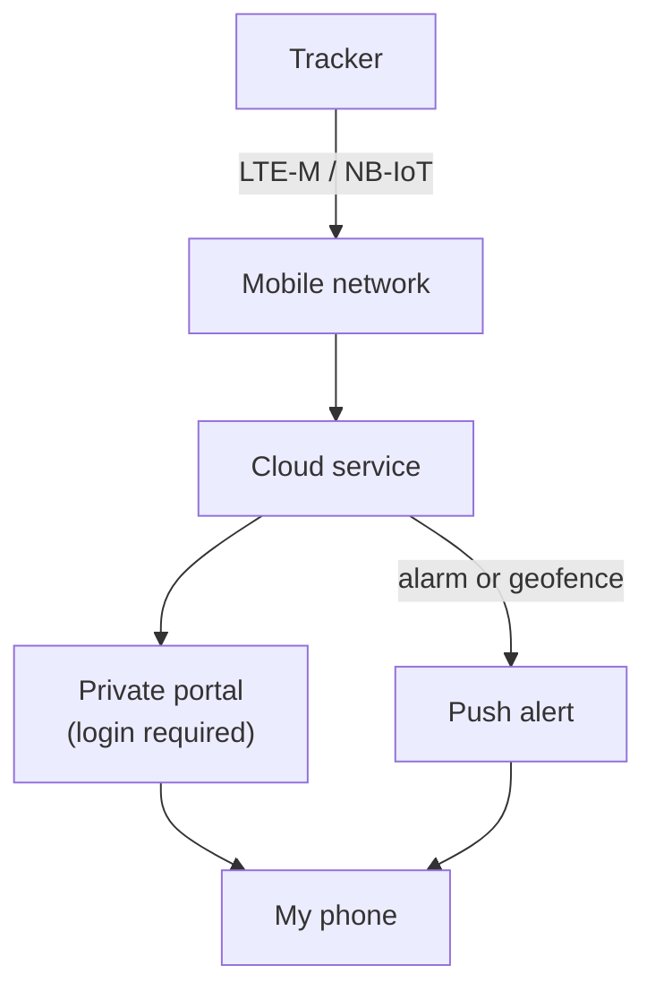

# Portal

The portal is the private website or app where I see the tracker's location on my phone. It is always behind a login.

## How data flows

## Architecture

Not chosen yet. Problems P10 and P16 will decide it.

## Decisions

| Decision | Options considered | Why |
|---|---|---|
| Portal must be private behind a login | Public map; private portal | Children's locations must never be public. Non-negotiable. |
